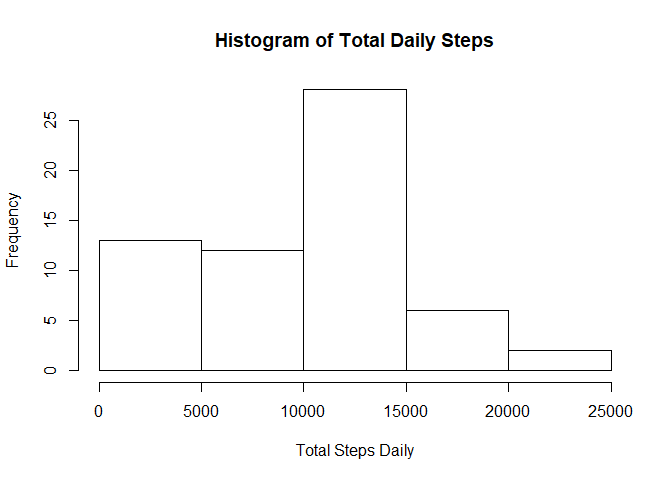
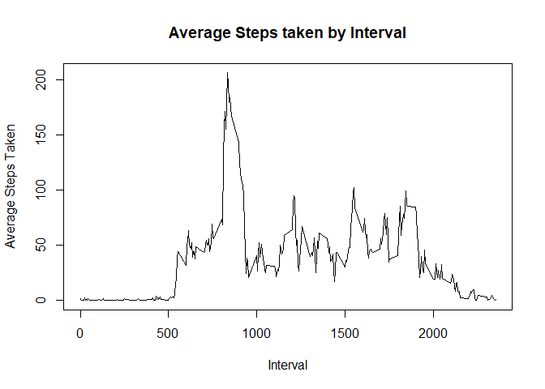
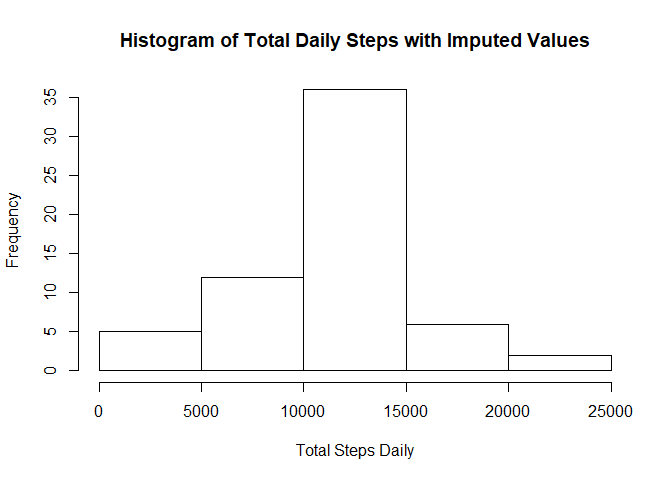
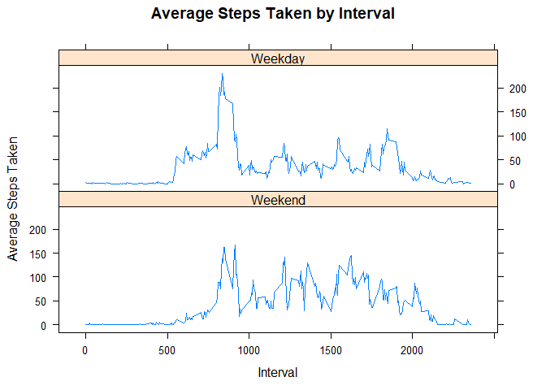

## Loading and preprocessing the data


```r
activitydata<-read.csv("activity.csv")
```

Load the data by reading in the .csv file.


```r
str(activitydata)
```

```
## 'data.frame':	17568 obs. of  3 variables:
##  $ steps   : int  NA NA NA NA NA NA NA NA NA NA ...
##  $ date    : Factor w/ 61 levels "2012-10-01","2012-10-02",..: 1 1 1 1 1 1 1 1 1 1 ...
##  $ interval: int  0 5 10 15 20 25 30 35 40 45 ...
```

If we look at the structure of the data, we see that the Steps Variable is Integer, the Date Variable is a Factor, and the Interval Variable is also Integer. For now, we will keep things formatted as they are.

## What is mean total number of steps taken per day?


```r
TotalStepsDaily<-tapply(activitydata$steps,activitydata$date,sum,na.rm=TRUE)
hist(TotalStepsDaily,main="Histogram of Total Daily Steps", xlab="Total Steps Daily")
```

<!-- -->

If we take the sum of Steps by Date (ignoring the NA values), and plot the Histogram of those Totals, we can see the frequency distribution of Total Steps Daily.


```r
MeanTotalStepsDaily<-mean(TotalStepsDaily)
MeanTotalStepsDaily
```

```
## [1] 9354.23
```

```r
MedianTotalStepsDaily<-median(TotalStepsDaily)
MedianTotalStepsDaily
```

```
## [1] 10395
```

Taking the Mean of the Total Steps Daily, we get **9354.23**, and taking the Median we get **10395**.

## What is the average daily activity pattern?


```r
AverageStepsInterval<-tapply(activitydata$steps,activitydata$interval,mean,na.rm=TRUE)
plot(x=names(AverageStepsInterval),y=AverageStepsInterval,type="l",main="Average Steps taken by Interval",xlab="Interval",ylab="Average Steps Taken")
```

<!-- -->

Next, we take the Mean of steps by Interval (again ignoring the NA values), and plot the Average Steps taken by Interval as a time series plot.

But which Interval has the highest Average Number of Steps taken?


```r
WhichIntervalMax<-names(which.max(AverageStepsInterval))
WhichIntervalMax
```

```
## [1] "835"
```

We can see that the Interval with the highest Average Number of Steps is Interval **835**.

## Imputing missing values

Now we want to see if imputing values into the NA observations will give us the same results.

First -- how many NAs are present in our Steps Variable?


```r
HowManyNAs<-sum(is.na(activitydata$steps))
HowManyNAs
```

```
## [1] 2304
```

So, there are **2304** NA entries in the Steps Variable.

Let's fill in those NA entries with the average Steps for the Interval of each of those observations. We'll do this with a duplicate of our ActivityData data frame and then plot a histogram of the results.


```r
activitydataImputed<-activitydata
activitydataImputed$steps<-with(activitydata,ave(steps,interval,FUN=function(x) replace(x,is.na(x),mean(x,na.rm=TRUE))))
TotalStepsDailyImputed<-tapply(activitydataImputed$steps,activitydataImputed$date,sum,na.rm=TRUE)
hist(TotalStepsDailyImputed,main="Histogram of Total Daily Steps with Imputed Values", xlab="Total Steps Daily")
```

<!-- -->

Looking at the Frequency Distribution of our Imputed data, we can see that it looks a little different from our first Histogram of the Total Daily Steps where we ignored the NAs.

So how do our new Mean and Median compare to our first values?


```r
MeanImputed<-mean(TotalStepsDailyImputed)
MeanImputed
```

```
## [1] 10766.19
```

```r
MedianImputed<-median(TotalStepsDailyImputed)
MedianImputed
```

```
## [1] 10766.19
```

Taking the Mean of our Total Steps Daily including the Imputed values, we get **10766.19**, and taking the Median we get **10766.19**.

Compare those to our original results -- ignoring the NAs instead of imputing them, we had a Mean of **9354.23**, and a Median of **10395**.

## Are there differences in activity patterns between weekdays and weekends?

To see if there are differences between Weekdays and Weekends, first we need to create a Factor Variable that labels each observation as "Weekday" or "Weekend", based on the date. Since we did not pre-proces our Date Variable, we will need to make sure we convert that Variable to a Date when we do this.


```r
Weekdays<-weekdays(as.Date(as.character(activitydataImputed$date)))
WeekdaysFactor<-factor(Weekdays,levels=c("Monday","Tuesday","Wednesday","Thursday","Friday","Saturday","Sunday"))
activitydataImputed$DayOfWeek<-factor(unclass(WeekdaysFactor)<=5,levels=c(FALSE,TRUE),labels=c("Weekend","Weekday"))
```

Now that we've labeled each observation according to whether they occurred on a weekday or a weekend, we can take a look at our Average Steps by Interval between the two.


```r
AverageStepsIntervalDayOfWeek<-aggregate(steps~interval+DayOfWeek,data=activitydataImputed,mean)
xyplot(steps~interval|DayOfWeek,data=AverageStepsIntervalDayOfWeek,layout=c(1,2),main="Average Steps Taken by Interval",xlab="Interval",ylab="Average Steps Taken",type="l")
```

<!-- -->

It looks like there is a difference between the two after all - especially around the peak Interval we saw before, Interval **835**.
